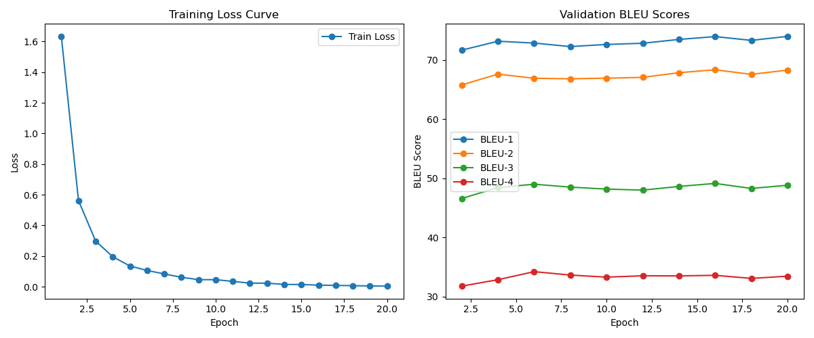

# Chinese Question Answering Model using T5-Base

## Background

This project involves developing a question answering model using Google's T5-Base. The model is designed to generate answers based on a given question and a passage of text. Unlike extractive models, which select answers directly from the text, this project focuses on a generative approach.

## Model Overview

The T5 model serves as the backbone for this generative question answering task. The model is trained using a provided dataset to generate answers to questions based on the context provided.

## Data Format

The dataset is in JSON format, with each line representing a data sample:

```json
{
  "context": "违规分为:一般违规扣分、严重违规扣分、出售假冒商品违规扣分,淘宝网每年12月31日24:00点会对符合条件的扣分做清零处理,详情如下:|温馨提醒:由于出售假冒商品24≤N<48分,当年的24分不清零,所以会存在第一年和第二年的不同计分情况。",
  "answer": "12月31日24:00",
  "question": "淘宝扣分什么时候清零",
  "id": 203
}
```

- **context**: The reference passage.
- **question**: The question to be answered.
- **answer**: The correct answer to the question.

## Evaluation Metrics

The model's performance is evaluated using BLEU scores:
- BLEU-1
- BLEU-2
- BLEU-3
- BLEU-4

These metrics assess the quality of the generated answers by comparing them to the reference answers.

## Project Structure

- `h1.py`: Contains code for model downloading, data processing, training, and evaluation.
- `pre.py`: Loads the best model and performs predictions on the development set.
- `train.log`: Logs information during the training process.

## Dependencies

- Python 3.x
- PyTorch
- Transformers
- TQDM
- SacreBLEU
- Matplotlib

## Installation

```bash
pip install torch transformers tqdm sacrebleu matplotlib
```

## Usage

### Training the Model

1. Ensure the dataset files `train.json` and `dev.json` are in the project directory.
2. Run `h1.py` to train and evaluate the model.

```bash
python h1.py
```

The training process logs the loss and BLEU scores for each epoch and saves the best model.

### Prediction

1. Ensure the best model file `best_model.pth` is available.
2. Run `pre.py` to perform predictions on the development set.

```bash
python pre.py
```

The script outputs the reference and generated answers.

### Visualization

After training, `h1.py` generates a convergence curve `convergence_curve.png`, showing the training loss and validation BLEU scores.

## Logging

Detailed information about the training process is recorded in `train.log`, including batch losses and average losses per epoch.

